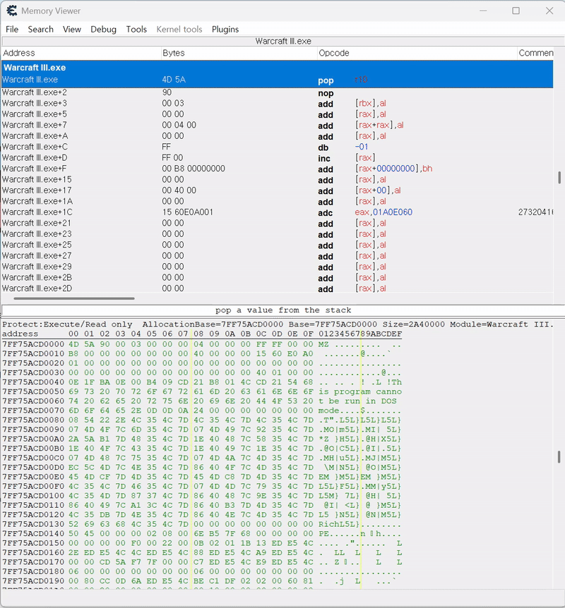

# Memory Remapper

## 개요

Memory Remapper는 Cheat Engine용 플러그인으로, `SEC_NO_CHANGE` 속성으로 매핑된 메모리 영역을 다시 매핑하여 해당 속성을 제거하는 도구입니다. 이를 통해 보호된 메모리 영역을 수정 가능한 상태로 변환할 수 있습니다.

## 주요 기능

- **메모리 영역 스캔**: 현재 프로세스의 매핑된 메모리 영역을 실시간으로 스캔하고 표시
- **보호 속성 확인**: 각 메모리 영역의 보호 속성 (PAGE_READONLY, PAGE_EXECUTE_READ 등) 확인
- **메모리 재매핑**: `SEC_NO_CHANGE` 속성이 적용된 메모리 영역을 `SEC_COMMIT`으로 재매핑
- **실시간 업데이트**: 메모리 상태 변경 후 실시간으로 목록 갱신

## 설치 방법

1. 컴파일된 `MemoryRemapper.dll` 파일을 Cheat Engine의 플러그인에 추가
2. Memory View에서 "View Mapped Memory Regions" 메뉴 항목 확인

## 사용 방법

1. Cheat Engine에서 대상 프로세스를 연결
2. Memory View를 열고 "View Mapped Memory Regions" 메뉴 클릭
3. 매핑된 메모리 영역 목록이 표시됩니다:
   - **첫 번째 열**: 메모리 영역 이름/주소
   - **두 번째 열**: 영역 크기 (16진수)
   - **세 번째 열**: 보호 속성
   - **네 번째 열**: 매핑된 파일 이름
4. 재매핑하고자 하는 영역을 선택 후 우클릭하여 "Remap Memory Region" 메뉴 클릭

